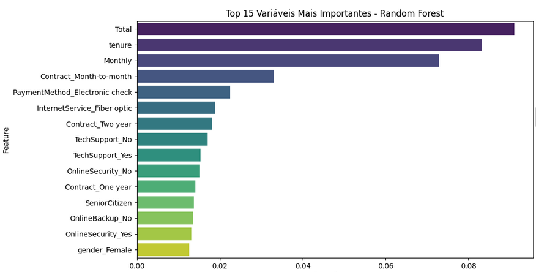
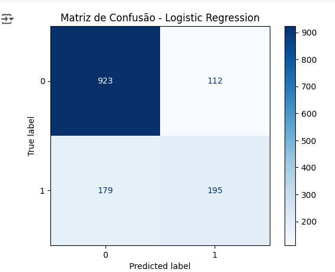
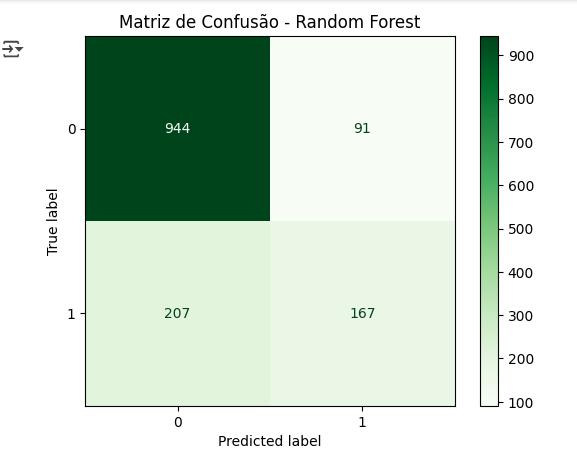

# 📡 Telecom X – Prevendo Churn

Este projeto foi desenvolvido como parte de um desafio de **Machine Learning** para a empresa fictícia *Telecom X*, com o objetivo de **prever a evasão de clientes (churn)**.  

Após a análise exploratória realizada na **Parte 1**, esta segunda etapa concentra-se na **construção e avaliação de modelos preditivos**, permitindo identificar clientes com maior risco de cancelar seus serviços e possibilitando ações preventivas.

---

## 🎯 Objetivos
- 📊 Preparar e pré-processar os dados (tratamento de NaN, encoding, normalização).
- 🔍 Realizar análise de correlação e seleção de variáveis relevantes.
- 🤖 Treinar e avaliar modelos de classificação.
- 📈 Interpretar os resultados, identificando as variáveis mais importantes para prever churn.
- 🛠️ Fornecer recomendações estratégicas para retenção de clientes.

---

## 🧠 Modelos Utilizados
- **Regressão Logística**
- **Random Forest Classifier**

---

## 📊 Principais Resultados

### **Logistic Regression**
- **Acurácia**: 79,3%  
- **Precisão**: 63,5%  
- **Recall**: 52,1%  
- **F1-score**: 57,3%  
- **ROC-AUC**: 0,843  
- Melhor recall, capturando mais clientes com risco de churn.

### **Random Forest**
- **Acurácia**: 78,9%  
- **Precisão**: 64,7%  
- **Recall**: 44,6%  
- **F1-score**: 52,8%  
- **ROC-AUC**: 0,826  
- Mais preciso, mas com recall menor.

---

## 📈 Visualizações

### Importância das Variáveis (Random Forest)


### Matriz de Confusão – Logistic Regression


### Matriz de Confusão – Random Forest


> *As imagens devem ser salvas na pasta `imagens/` do repositório para exibição correta.*

---

## 🚀 Tecnologias Utilizadas
- **Python 3**
- **Pandas**
- **NumPy**
- **Scikit-learn**
- **Matplotlib**
- **Seaborn**

---

## 📌 Conclusão
Os resultados mostram que:
- **Logistic Regression** é mais indicado quando o objetivo é **maximizar a identificação de clientes propensos ao churn**, mesmo que gere mais falsos positivos.
- **Random Forest** é mais indicado quando a prioridade é **reduzir falsos positivos**, aceitando um recall menor.

As variáveis mais relevantes encontradas:
1. Total gasto pelo cliente (`Total`)
2. Tempo de permanência (`tenure`)
3. Valor mensal pago (`Monthly`)
4. Tipo de contrato (`Contract_Month-to-month`)
5. Forma de pagamento (cheque eletrônico)

Essas informações podem guiar campanhas de retenção e personalização de ofertas.

---

## 📂 Estrutura do Projeto
```plaintext
├── Parte1_Analise_Exploratoria.ipynb   # Notebook da análise exploratória
├── Parte2_Modelagem_Churn.ipynb        # Notebook de modelagem preditiva
├── dados_tratados.csv                  # Dataset tratado na Parte 1
├── imagens/                            # Gráficos e visualizações
│   ├── variaveis_importantes.png
│   ├── matriz_confusao_logistic.png
│   └── matriz_confusao_rf.png
└── README.md                           # Descrição do projeto


---

## ✍️ Autor
Projeto desenvolvido por **Ramires Rocha** como parte de um desafio de Machine Learning.
